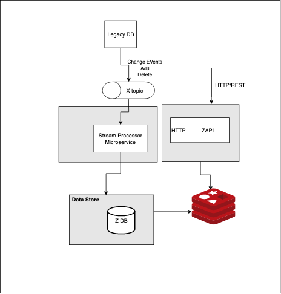
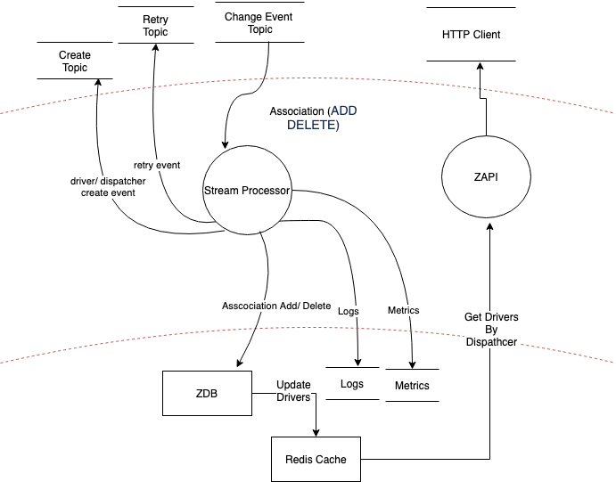
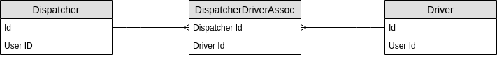

Z Data Pipeline
=========================
The goal of the project is to process the published change events coming from the legacy system and expose an API for Dispatcher & Driver association

### Architecture


Architecture has 2 microservices :
- Stream Processor, asyncronous microservice process the change events to add/delete dispatcher driver asscociation. It creates the Driver/ Dispatcher entities before it creates association 
  if entities not exisit in the Database.
-  ZAPI, synchronus microservice returns the drivers associated for the dispatcher

### Alternate approach
 This architecture can also be built without Redis component, isntead use API DB as data source for RestAPI as well. It requires SQL queries need to be executed for every GET calls which may be slow in performance 
  
Parition Keys
--------------
ChangeEvent topic is partitioned by DispatcherId key

Technologies
------------
- GKE Pub/Sub or Kafka & Zookeeper
- Postgres or MySQL
- Kubernetes
- Redis
- Docker Compose to link the containers on local machine.

### Data Flow


1. Change Event notification come as add or delete Driver for a Dispatcher
2. Stream processor verifies if Driver/Dispatcher entity exists in DB, 
   If not exist
   1. push create events for both the driver and dispatcher
   2. push source message to retry topic and move on
3. If exist, Update the Driver/Dispatcher association in DB based on the event being processed (Add/Delete)
4. Redis Cache gets updated for the Dispatcher
   Sample Redis Data:
    DISP-<DispathcherId> : [DriverId1, DriverId2, DriverId3 ..]
5. For Add Event, new DriverId added to the set
6. For Delete Event, DriverId removed from the set

### Create Topic
Consumer/Listener creates the driver or dispatcher entity if not exist in API DB

### Retry Topic
Consumer reprocess the messages perform either of the following actions
1. Add/Delete the association based on the message action
2. Ignores the message if timestamp is older (out of order) than the message which exist in DB

### API DB
Entities
--------
 - Driver
 - Dispatcher
 - Dispatcher/Driver Association (One to Many)

Refrential Integrity
--------------------
 Driver & Dispatcher Foreignkeys should exist before inserting into to Association table
 

### Dispatcher-DriverAssociation table schema
| Field Name           | Description  |
| -------------------- | -----------------------------------|
| Id                   |                                    |
| DispatcherId         |                                    |
| DriverId             |                                    |
| isAssociated         | Boolean                            |
| LastMessageTimeStamp | TimeStamp                          |

### FAQ

1. How does the system ensure that a Driver isn't associated to mulitple Dispatchers at any given time ?
Before adding any association for the driver, microservice queries the DB to find out any existing driver-dispatcher relationship exist and if does push the message to retry topic. A retry counter needs to setup to aviod indefinte loop, if its exceeds threshold it needs to move to DLQ

2. What happens to HTTP call for /getdispatcher/{id} for the dispatcher not exist in DB ?  
    HTTP 404 or empty JSON   


## Original Context of the project
```
Design a system that would keep the association up to date given:
 
* Changes to the association are published to our data pipeline as individual records mapping one dispatcher to one driver,an action of ADD or DELETE, and a timestamp.
* Dispatchers have multiple drivers and those drivers change frequently. See Dispatcher-Driver_Relationship.png
* Dispatcher/Driver association records may appear in the data pipeline before the corresponding dispatcher and driver entities exist in the APIs.
* Changes to the dispatcher/driver association originate in legacy systems and not in our APIs
* Google Pub/Sub does not maintain message order
* Google Pub/Sub guarantees at least once delivery
* If a message is not acked, Pub/Sub will wait for up to 10 minutes and immediately redeliver the message at the front of the queue.
* There may be a large number of change events in the pipeline
```